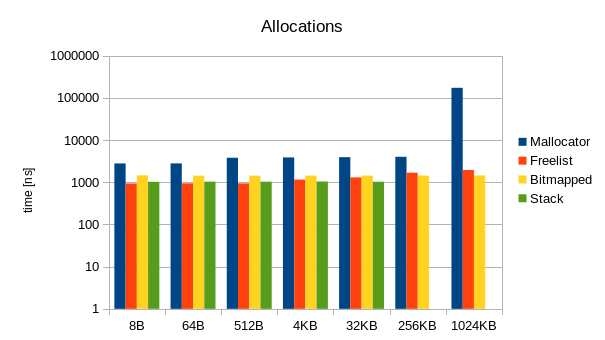
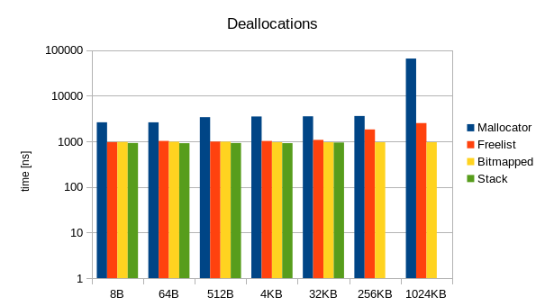

---
title: "Composable Allocators"
author: Henruch Lauko, Katarína Kejstová, Jíří Novotný
output:
beamer_presentation:
theme: "boxes"
colortheme: "whale"
highlight: tango
keep_tex: true
fontsize: 10pt
...

## Motivation

```cpp
    void* malloc(size_t size);
    void free(void* ptr)
```
- saving information about size
- size management adds difficulties to allocator design

###Andrei Alexandreiscu recomendation

```cpp
struct Block { void* ptr; size_t size; }
```
## std::alocator

- big fail - nobody knows how to use
- "Making Allocators Work", CppCon 2014

### Some oddities 
- type as parameter (allocator is not a factory)
- `rebind<U>::other`
- allocator should work only with blocks

## C++ Allocators
- we want allocator to be composable
- specialized by size

- our API requirements on allocator:
```cpp
Block allocate(size_t)
void deallocate(Block)
bool owns(Block)
```

## Base Allocators

```cpp
NullAllocator

Mallocator

StackAllocator<size_t size>
```

## Composable Allocators

```cpp
FallbackAllocator<class Primary, class Fallback>

Freelist<class Allocator, size_t min,
         size_t max, size_t capacity>

Segregator<size_t threshold, 
           class SmallAllocator, class LargeAllocator>

AffixAllocator<class Allocator, 
               typename Prefix, typename Suffix>

StatisticCollector<class Allocator, int Option>

BitmappedBlock<class Allocator, size_t block_size>
```

## Modularity -- composability

- composition of allocators, specialized by block sizes
- arrays, lists, trees of allocators

```cpp
using Allocator =
        Segregator<1024, 
            Segregator<512, 
                Freelist<Mallocator, 0, 512,
                Freelist<Mallocator, 513, 1024>
            >,
            Mallocator
        >;
```

## Benchmarks Allocation



## Benchmarks Deallocation


